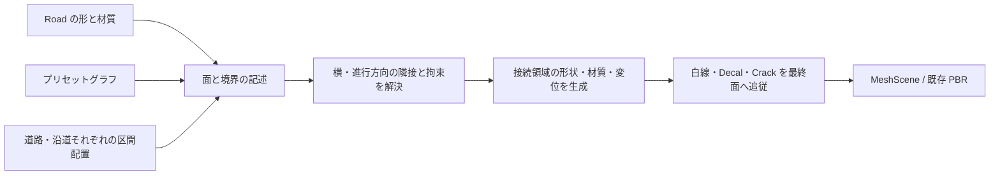

# 道路・沿道プリセット・区間配置・自動接続への移行計画

作成日時: 2026-09-07 14:46
更新日時: 2026-09-07 16:13

状態: P0の固定シーンでの最小実証を完了。P1は記述・保存・Undoの第一段まで実装。プリセット・区間編集は未着手。型名・ノード名は仮称。

## 1. 目標と操作

作業者は道路沿いに「何を、どこまで置くか」を指定する。プリセット作者はノードグラフで形・材質・端の性質を作る。
横方向と進行方向の接続、段差、素材の食い込み、変位の整合はエディタが生成する。
材質の一致、接続相手別のプリセット、頂点合わせを通常操作の条件にしない。

例: 道路左側の 0〜12 m は砂利、12〜25 m は草地、25〜40 m は高さ 0.15 m の歩道。
歩道の 30〜34 m は出入口として高さをすり付ける。道路幅・線形・バンクを編集しても配置と接続が追従する。
右側は独立して配置でき、横に路肩→歩道→草地の複数帯も並べられる。

道路本体も同じ区間配置の対象とする。新しいアスファルト→荒れた舗装→砂利道を一本の Road 上に配置し、
切替位置と移行距離で徐々に変化させる。道路と左右の沿道は別々の区切りを持てる。
道路を材質ごとに別の Road ノードへ分割する操作は不要にする。

通常操作はプリセットの割当、区間の分割・伸縮、幅・高さなど公開項目の調整。
切替位置には既定の移行範囲を自動で設け、必要なときだけその長さや段差の意図を上書きする。
「砂利と草を接続する専用ノード」などを配置者に作らせない。

## 2. 現状から変える点

| 現在の実装 | 制約 | 移行後 |
| --- | --- | --- |
| `BuildRoad` / `RoadGeometry` の行・列・`rowDistances` | 道路一本を格子で表す | 道路生成を再利用し、配置と接続に共通の実距離基準を提供 |
| `BuildShoulder` が境界の位置をコピーし全長を押し出す | 幅・勾配・材質が全長共通。独立メッシュ間で位置を合わせる方式 | 区間と断面の記述から面の領域を作り、接続領域をまとめて生成 |
| `stepHeightMeters` は 0〜0.5 m の下がり段差と面取り | 上がる歩道・縁石の垂直面・歩道の始終端を表せない | 符号付き高さ差、断面、立ち上がり、端面、局所的なすり付け |
| Road / Shoulder がそれぞれ 4 材質と RGB マスクを持つ | 両者のスロット・座標・変位量を手で一致させる必要がある | 各面の材質構成を維持し、境界では共通の評価結果を参照 |
| `MeshPbr.hlsl::ApplyDisplacement` が各面の法線方向へ変位 | 元頂点の位置だけ同じでも、変位後に隙間が生じ得る | 境界の最終位置・変位方向を共有し、段差面は別の法線を保持 |
| `EvaluateMeshChain` が枝ごとにシーンを作り、Merge が集める | 隣接する複数面を調整する段階が無い | 部品の記述→隣接解決→接続を含むシーン生成の段階を追加 |
| `.tgmat` は PBR 素材。`NodeGraph` は道路等のシーングラフ | 再利用可能な断面・境界・公開パラメータの資産が無い | 素材と区別した沿道プリセット資産・専用グラフ出力 |

再利用: Path、縦断・バンク、実距離 UV、材質ライブラリ、Road Mask の関数、PBR / RHI、ノード編集、UndoHistory。
旧地形評価器は復活させない。全面的なディファード化、任意メッシュの自動ブーリアンを前提にしない。

## 3. 編集データの分担

| データ（仮称） | 持つ情報 |
| --- | --- |
| `SurfacePreset` | 道路・沿道に共通の資産。安定した資産 ID、版、名前、対象の役割、プリセットグラフ、公開パラメータ、素材参照 |
| `CrossSection` | 横方向の断面点・面の役割。地面、舗装天端、縁石側面など。幅・高さの拘束 |
| `BoundaryContract` | 内端・外端・始端・終端の条件。混在可否、輪郭保持、固定高さ、許容調整幅、境界へ出せる素材 |
| `RoadLayout` | 接続先 Road ID、道路本体と左右の帯の並び、それぞれ独立した区間列 |
| `SurfaceSpan` | 安定した区間 ID、対象面・帯 ID、開始・終了距離、Preset ID、公開値の上書き、乱数種 |
| `ConnectionOverride` | 特定の区間境界・帯境界に対する意図の上書き。自動／すり付け／段差保持、移行幅など |
| `ResolvedSurfaceSet` | 評価結果のみ。領域、隣接、生成面、境界共有情報、材質参照、診断。保存しない |

プリセットグラフは最初から任意のシーングラフを入れ子にしない。
第一版は断面・材質構成・境界条件・公開値を専用の出力へ渡す小さな DAG とする。
既存 Surface は材質参照として再利用し、Road Mask は面のローカル座標で使える関数へ整理する。
プリセットが配置先のシーンや隣のプリセットを書き換える参照は禁止し、相互依存を作らない。

### 連続する人工物の部品アセット

マテリアル一覧とは別に、再利用する人工物を選ぶ「部品」のアセット一覧を設ける（P3〜P4）。
GPUメッシュを並べるだけでなく、断面や生成設定を含めた部品資産として管理する。

| 部品の種類 | 用途 | 配置方法 |
| --- | --- | --- |
| 断面部品 | 縁石、側溝、歩道の縁 | 断面を実距離に沿って延ばす。カーブへ追従 |
| 反復部品 | コンクリート平板、ブロック、柵 | 実寸と目地・間隔を保って並べる。剛体／許容する変形を明示 |
| 端部部品 | 蓋、終端、角、出入口の切下げ | 始終端や接続条件から選択・生成 |

部品は資産 ID・版・実寸・軸と原点・材質スロット・接続端の位置と向き・変形許容範囲を持つ。
断面と生成設定を正として保持し、生成メッシュは再構築する。持込メッシュの対応形式は導入時に決める。
プリセットは部品を参照して幅・間隔・仕上げを定め、区間配置はそのプリセットを参照する。
終端で長さが余る場合は、切断可・目地で調整可・端部で埋める等の部品側の条件を使い、自動で選ぶ。
接続には既存の BoundaryContract を使い、部品相手ごとの組み合わせ表や位置合わせを作者へ要求しない。
適合する端部が無い場合は汎用の断面端面を生成できる範囲を定め、それ以外は寸法付きで診断する。

一覧は既存ドッキングのアセット領域にタブとして追加する方針。新しい常設パネルを画面へ積み上げない。
配置者にはサムネイル・用途・実寸を見せ、プリセット編集時に部品と素材を組み合わせられるようにする。
今回の仮コンクリート平板は生成式による部品の原型であり、部品ライブラリそのものの実装ではない。
部品資産と依存素材も保存・版指定・コピー／貼り付け・Undo の対象とし、プリセット資産と同じ参照規則を適用する。

### 道路の形と路面の仕上げを分ける

Road は中心線・幅・車線・縦断・バンクを保持し、路面プリセットは材質構成と表面の状態を担当する。
プリセットを砂利道に替えても、道路の幅や縦断・車線設定は自動変更しない。
道路本体の第一版は全幅に対する区間割当とし、車線別・片側だけの舗装替えは後続の横領域指定へ拡張する。
データ上は道路も対象面 ID を持つ帯として扱い、沿道専用の区間型を作らない。

「荒れた舗装」は別の画像への色の補間だけでなく、粗さ・法線・ハイト・変位量・骨材や土の被覆率を含む構成として作る。
同じプリセット内では公開値「荒れ具合」などを区間の始終端で連続変化させられるようにする。
異なるプリセット同士は移行領域の共通評価で混ぜる。長い移行でも同じ基盤を使い、UV・轍・ノイズの距離基準を継続する。
立体的な穴やひびの分岐まで材質だけで実現したことにはしない。Crack 等の配置量への連携は既存 R4 拡張時に加える。

白線等の標示は路面仕上げと別の配置情報として保持し、変位後の面へ追従する。
砂利区間へ替えたことだけで標示を削除しない。区間ごとに標示の表示・摩耗を指定する機能を P2〜P4 に含め、
舗装終端で白線を残す／薄くする／終える意図を保存できるようにする。

## 4. 横方向と進行方向の座標・編集規則

- 共通座標は道路始点からの距離 `s`（m）と左右を持つ横位置 `t`（m）。帯ごとの UV とは分離する。
- 接続先は Road ID・帯 ID・境界 ID で記録する。近接する別の道路や上下に重なる面へ距離だけで接続しない。
- 道路の長さを変えても開始からのメートル位置を保持し、全長を覆う区間だけ終端追従を既定とする。
  短縮して区間が範囲外になった場合は評価時にクリップし、元の編集値は保存して通知する。後で伸ばせば復帰する。
- 同じ帯では区間を順序付きの区切りとして管理し、内部の隙間・重複を通常編集で作らない。
  空白は明示した「配置なし」区間で表す。外側の帯の始終端や幅 0 は端面・消滅遷移の対象とする。
  道路本体で仕上げ未指定の区間は上流 Road の既存材質を使い、道路の面そのものを消さない。
- 切替位置に移行範囲を設ける。短い区間で前後の範囲が重なる場合は、その周辺全体の重みを一度に解決する。
  プリセットの内部 UV は区間ごとにリセットせず、既定では道路の実距離に連続させる。
- 境界ノイズは安定 ID・乱数種・共通座標から決める。別区間の追加や再分割で全体の模様が変わらないようにする。
- 道路の分割・結合・向きの反転には区間の再対応が必要。第一版ではこれらを自動推測せず、対応操作の追加まで対象外とする。

## 5. 自動接続の評価

### 接続相手の種類ではなく性質を使う

接続は少数の演算（連続面、すり付け、立ち上がり、端面、素材の混在、輪郭沿いの堆積）を条件から構成する。
砂利×草、草×歩道などの固有名による組み合わせ表は作らない。
高さや輪郭の固定条件を先に解き、許容範囲内で形を調整し、その後に装飾を加える。
両側を満たせないときは影響する接続領域だけを診断対象にし、元の面を保持する。
必要な移行幅と不足量を示し、配置者が幅・高さ・接続方法を直せるようにする。暗黙に歩道を平らに潰さない。

### 一つの接続領域を作る

横境界と区間境界が交わる場所では、二本のブレンド帯を重ねない。
周囲の面を集め、一つの局所領域として被覆率を正規化し、形と材質の所有範囲を決める。
共通の境界模様に対して舗装の占有が増える場所では土が減るようにする。
人工物の輪郭を混ぜない設定では、輪郭を維持して足元の堆積・植生だけを変化させる。

接続領域の地表は一度だけ描く。元の道路・路肩の該当領域を置き換えて生成し、上から帯を重ねて隠す方式にしない。
内部では必要な頂点の共有・再分割を自動で行ってよいが、それを作者の制約や編集データにしない。
区間境界と接続領域端を必須標本として追加し、同じ境界の頂点・テセレーション分割を共有する。
歩道の垂直面は断面から実際の面として作る。一枚の高さ場で上下の面と垂直面を無理に表現しない。

### 材質と変位

4 スロットは当面「一つの面の材質構成」の上限として再利用する。接続全体を 4 スロットへ無理に詰めない。
接続領域は複数の材質構成を参照できる描画データへ拡張し、各構成の UV・反復長・ハイト・変位量を保持する。
両者で同じ材質を選ぶことや、端の層を予約しておくことは要求しない。

最初の検証は 2 構成（最大 8 素材）、次に横・進行方向が交わる 4 構成（最大 16 素材）を対象にする。
同じ素材評価の共有、寄与ゼロの除外、局所領域への限定を行い、通常の面は既存 4 スロットのまま描く。
同一点で混ざる素材数は描画負荷に直結するため、単純な描画バッチ分割だけでは解決しない。
4 構成の検証で予算を超える場合は、寄与の小さい境界装飾を減らす品質段階と接続領域専用の評価キャッシュを比較し、P2 の完了前に方式を決める。
全道路のユニーク PBR テクスチャへの焼き込みは既定にしない。

色だけでなく、変位後の共通位置を一致させる。法線方向が違えば同じハイトでも位置は一致しない。
接続領域の外周は元の面の最終位置に一致させ、内部は共通の変位評価を使う。
色・影・深度・テセレーション・白線等の追従も同じ評価を参照する。
法線合成は共通接空間へ変換したうえで RNM を使う。垂直面の UV は断面距離と進行距離で作り、ワールド XZ の潰れを避ける。

### 所有権とグラフ

新しい `Road Layout` ノード（仮称）が上流の道路記述を受け、道路本体・沿道の配置と自動接続を解決した出力を返す。
道路への素材侵入はこの出力に含める。上流 Road ノードや共有 MeshScene を直接変更しない。
上流単独プレビューは元の道路、Layout 出力は仕上がった道路と沿道となる。
元の道路と加工済みの道路を Merge した場合は、由来 ID と評価版で置換・重複を判定する。
異なる Layout が同じ領域を別々に置換する場合は競合を示し、接続順に依存してどちらかを選ばない。
白線・面上 Path の参照も単一のメッシュ配列番号から安定した面 ID と座標へ移す。

## 6. 保存・共有・アンドゥ

- 最初はプロジェクト内にプリセットを埋め込み、配置は ID 参照と上書きだけを持つ。同じプリセットの変更は全参照へ反映する。
- 別プロジェクトへ渡すときはプリセットグラフ・公開値・材質参照を資産として書き出す。既存 `.tgmat` を断面資産へ転用しない。
  外部ライブラリからは版を指定して取り込み、外部ファイル変更による無断の見た目変更を避ける。更新は明示操作とする。
- 現在の版16はそのまま読める。新規データ導入時に形式の版を上げ、旧ファイルには空のプリセット・配置を補う。
- 既存 Shoulder は当面そのまま評価し、「プリセット＋全長区間へ変換」で移行する。
  変換直後は接続仕上げを従来相当にして見た目を保ち、自動仕上げの有効化を別の編集として扱う。
- 既存 Road の材質・マスク・UV・変位設定も全長の路面プリセットへ変換できるようにする。
  Road の形状設定と素材参照を保持し、区間未指定時の旧経路と変換後の見た目を比較する。
- `DocumentSnapshot` にプリセット・配置・接続上書きを追加する。変換、区間ドラッグ、プリセット編集は Undo/Redo 対象。
  公開値とグラフ内部の ID、素材の欠落、資産削除中の参照も検証する。
- コピー／貼り付けは依存資産を同伴し、ID 衝突時は対応表を作る。共有プリセットの削除は参照を黙って消さない。
- 初期は全体再評価で正しさを優先する。区間キャッシュはプリセット版・隣接関係・接続設定・素材版をキーにし、
  編集区間と移行幅ぶんの隣接区間を更新する。GPU リソースは既存のフレーム同期と遅延解放を通す。

P1の第一段の仕様と未対応範囲は [配置記述の保存基盤](../reference/surface-layout-data.md) を参照。

## 7. 実装段階と完了条件

P0 の初期実証は [試作の使い方と限界](../reference/connection-prototype.md) を参照。水平直線で4層＋4層＋歩道1層の構成を実装済み。
元のUV・マスク・高さ条件を保持し、GPU負荷とサンプル点の変位後境界誤差を計測した。P0の固定シーンでの技術的成立を確認しP1へ進む。全テセレーション頂点や全視点の保証ではない。詳細は [計測資料](../reference/connection-diagnostics.md)。

| 段階 | 作業 | 完了条件 |
| --- | --- | --- |
| P0 接続の最小実証 | 現在の Road / Shoulder を入力に、横の接続と道路上の舗装→砂利の長さ方向の移行を試作。異なる 2 材質の変位・食い込みと +0.15 m の歩道断面を検証 | 材質一致を要求せず隙間・二重面が無い。影と変位を確認し、描画方式と負荷を記録 |
| P1 記述と保存の基盤 | `BoundaryContract`、断面、安定 ID、道路・沿道の共通配置区間、埋込プリセット、公開値の始終端値、版更新、Undo を導入 | 旧プロジェクトの互換、保存往復、Undo/Redo、決定的な生成が成功。道路3種と沿道3種をデータとして配置できる |
| P2 二方向の自動接続 | 道路・沿道の区間と横の帯を同じ隣接系で解決。段差・端面・すり付け、交わる移行領域、変位・標示の区間制御と追従を完成 | 新舗装→荒れた舗装→砂利道と、沿道の砂利→草→歩道・出入口がカーブ・縦断・バンク上で成立。区切りが一致／不一致の交点、短い区間、左右、幅変更を検証。描画予算を決定 |
| P3 プリセット作成 | 専用の小さなグラフ、公開パラメータ、サムネイル、保存・複製・取り込み、断面／反復／端部の部品資産参照を追加 | 道路3種と沿道3種をコード変更なしで作成・変更でき、荒れ具合の連続変化と相手別の接続定義なしで P2 の結果が成立。仮歩道を部品参照で再現 |
| P4 配置の操作 | ビューポートで区間の割当・分割・伸縮、帯の追加、局所上書き、診断表示。既存アセット領域に部品タブを追加 | ノードを区間数ぶん増やさず例の40 m道路を編集でき、1ドラッグ1Undo。操作動画・UI画像で確認 |
| P5 移行と最適化 | Road の材質と Shoulder の変換、依存資産コピー、局所キャッシュ、品質設定、実データ回帰 | 既存データを失わず移行・取消できる。速度とVRAMを測定し、旧経路撤去の可否を判断 |

順序は P0 → P1 → P2 → P3 → P4 → P5。P0 の技術的成立前に大きなプリセット UI は作らない。
最初の成果物は「直線道路の舗装→砂利への移行＋砂利路肩＋上がる歩道」の自動接続試作と計測結果。
最初の操作可能な一巡は P4。ノード名・プリセット資産の拡張子・表示部品は各実装段階で確定する。

主な変更先:

- `src/graph/Road.cpp/.h`: 道路サンプルの再利用、記述出力への橋渡し。接続評価は新規ファイルへ分離する。
- `src/graph/NodeGraph.cpp/.h`: Layout ノード、専用出力型、参照検証。プリセットのグラフは別データとして持つ。
- `src/renderer/MeshData.h`、`PreviewRenderer.cpp`、`shaders/MeshPbr.hlsl`: 接続領域の描画記述、複数材質構成、共有変位、面参照。
- `src/io/ProjectIo.cpp`、`src/app/UndoHistory.h`、`ApplicationDocument.cpp`: 新資産・区間・上書きの保存と復元。
- `ApplicationGraphPanel.cpp`、`ApplicationViewport.cpp`、`ApplicationPathEdit.cpp`: プリセット作成・区間操作・面上編集の追従。
- UI 実装は [design-guide.md](../design/design-guide.md) の Property*・テーマ・ドッキングに従う。

## 8. 検証と範囲

CPU テスト: 境界一致、段差面の向き、非有限値・縮退・自己交差の拒否、重みの総和、区間の端、左右反転、
安定 ID、プリセット参照循環の拒否、保存往復、変換取消、局所更新と全体更新の一致。
幾何誤差の判定はメートル単位で固定し、第一案は境界位置誤差 0.1 mm 以下。GPU 変位後の検証方法は P0 で確定する。

実機検証: 異なるハイト・変位量・UV・法線方向、テセレーション有無、近景・遠景、影、白線・Decal・Crack、
T字状に出会う帯と区間、極端に短い移行範囲。作業者による材質一致や頂点修正が不要なことを受入条件にする。
道路の長い材質移行と沿道の短い切替が重なる場合も検証し、道路・左右の区切りを揃える操作が不要なことを確認する。
同一プリセットの荒れ具合の始終端値、舗装終端での標示制御、路面未指定時の既存材質への復帰も対象にする。
P0 で既存50 m道路のフレーム時間・生成時間・VRAMを基準測定し、P2で許容増分を決める。未測定の速度は約束しない。
C++ は Debug ビルドと既存テスト、HLSL は DXC、描画は実機起動、UI は `--screenshot-ui` と手動操作で確認する。

第一版の対象は単一の分岐しない Road 本体の路面区間と沿道の帯・区間、地面・舗装・歩道の断面。
道路同士の交差点、任意の持込メッシュ同士の接合、張り出し・トンネル・多層断面、植生インスタンスの自動散布は後続。
草はまず地表材質として扱い、立体の草や石の配置は同じ領域情報を使う別の生成段階へ拡張する。

## 9. 既存計画との関係

R3 の路肩拡張と R5 の歩道・縁石に共通する基盤として、本計画を次の優先作業とする。
R4 のマスクスタンプ・Crack 第二段は後続に置き、面参照と接続評価が固まってから統合する。
R2 の自己交差検証は接続の成立に必要な範囲を P2 に取り込む。道路の完全な交差点処理は対象外のまま。
従来の「端の層を同じ素材にする」運用は既存データの互換経路として残し、新方式の要件にはしない。

参照: [plan.md](plan.md)、[progress.md](progress.md)、[道路材質の既存設計](../design/road-material-layers.md)。
